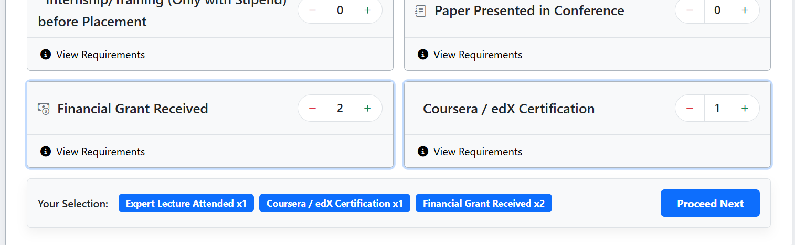
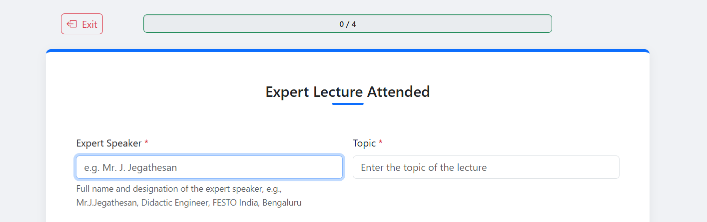
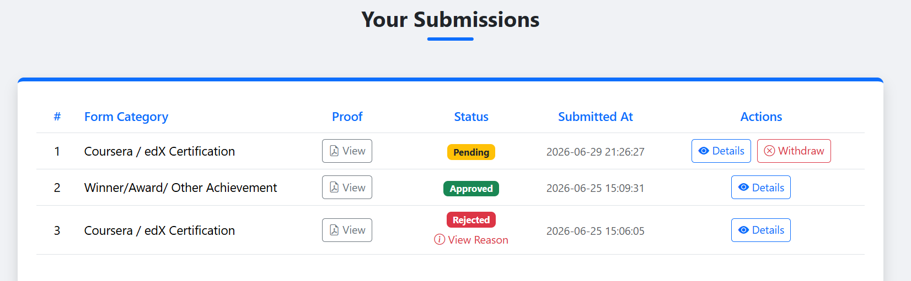
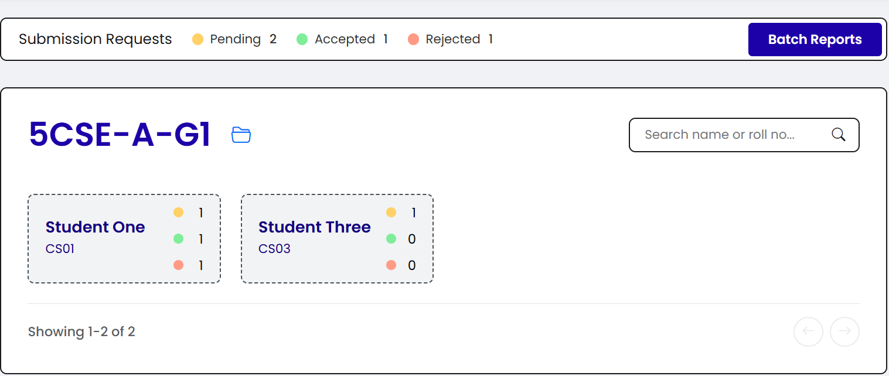
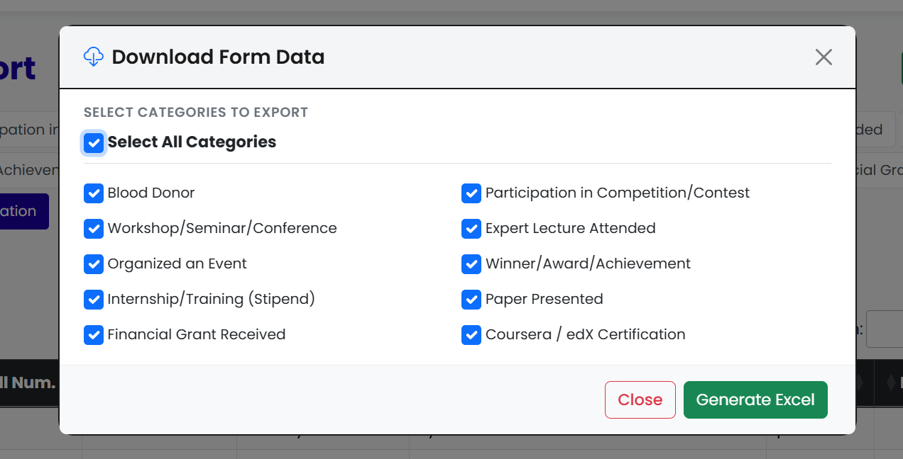

# SODECA Exam

> A role-based web application that streamlines the end-to-end SODECA exam submission and data management process for students, faculty, and administrators.

## What is SODECA?

**SODECA** (Social Outreach, Discipline, and Extra Curricular Activities) is a mandatory, non-teaching credit component in the curriculum of **Rajasthan Technical University (RTU), Kota** — an affiliating university that grants affiliation to approximately 90–130 colleges, including **Swami Keshvanand Institute of Technology (SKIT), Jaipur**.

## The Problem

The existing SODECA exam process is heavily manual and repetitive across all three stakeholders involved.

### Students
- A student submits an average of **3 entries per semester**, each requiring a separate Google Form submission.
- **Identical student details** (name, roll number, branch, etc.) must be re-entered for every submission.
- Fields irrelevant to a student's submission category must be manually filled with **"NA"**.
- Proof files must be **manually renamed** before upload in the pattern of RollNumber_StudentName_EventName e.g. 24ESKCS000_Rakshit_Verma_Thirak_2026

### Faculty (Batch Counsellors)
- The unified Google Form responses for an entire batch must be **manually categorized** into separate Excel files per submission type.
- Proof file names submitted by students must be **manually validated** for correct formatting.
- Proof files must be **manually organized into Google Drive folders** by category and batch before being shared with the exam conductor.

### Admin (Exam Conductor)
- Must **individually contact each batch counsellor** to collect batch-specific data.
- Tracking and maintaining SODECA records for future reference and analysis is entirely manual.

## The Solution

A role-based web portal that eliminates redundant data entry, automates file management, and gives each stakeholder a tailored, efficient experience.

### For Students
- **Auto-renamed proof files** — files are automatically renamed with the student's roll number, full name, and event name upon upload, removing the manual renaming step entirely.
- **Multi-step form** — students can submit multiple entries with any category of forms in a single session and their details automatically gets attached to those entries.

- **Submission status tracking** — students can view the real-time status of their submitted entries.

### For Faculty
- **Organized batch dashboard** — a clean overview of all students in the assigned batch with their submission details.

- **Auto-categorized Excel reports** — submission data is automatically sorted by category and ready to download as excels; custom-filtered exports are also supported.

- **Automated Drive folder organization** — upon acceptance of a submission, the associated proof file is automatically uploaded to the correct Google Drive folder, organized by category and batch.

### For Admin
- **Centralized access to all data** — access into SODECA records across all batches without needing to contact individual counsellors.
- **Persistent records** — all submission data is maintained in a structured format for future reference and analysis.

---

## Role Overview

| Role | Key Benefit |
|---|---|
| **Student** | Single-session multi-entry submission, auto file renaming, status tracking |
| **Faculty** | Auto-categorized exports, automated Drive folder management, batch dashboard |
| **Admin** | Instant access to all batch data, centralized tracking and record-keeping |
